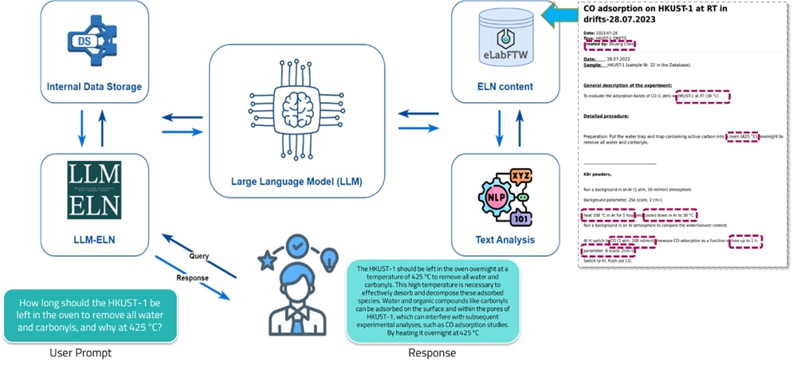

# Large Language Models in Electronic Laboratory Notebooks (LLM-ELN)

    

This project explores the transformative impact of Large Language Models (LLMs) within Electronic Laboratory Notebooks (ELNs) in the domain of materials science. The aim is to enhance research workflows, data management, and knowledge extraction through advanced AI-driven approaches.

    
    
Figure: Integration ecosystem of Large Language Models (LLMs) with Electronic Laboratory Notebooks (ELNs). This diagram illustrates the workflow from user prompts through internal data storage, LLM processing, and text analysis, to the final response within the ELN content.

## Main Components

- **LLM_ELN.ipynb**: This Jupyter Notebook is the central file where the integration of LLMs with ELNs is implemented and demonstrated.
- **LLM_MaterialsScience.ipynb**: Demonstrates examples of how LLMs can be utilized in the field of materials science to predict material properties, summarize research, and generate novel material compositions.
- **Evaluation_LLM_ELN.ipynb**: Contains the empirical evaluations conducted to assess the practical impact of LLMs on the research processes within materials science.
- **Plots_LLM_ELN.ipynb**: Provides visualizations and plots that illustrate the findings from the use of LLMs in materials science.

## Dataset

The dataset used in this project, titled _ELN Sample Files_, is located in the 'database' folder. It includes various electronic lab notebook entries that are processed and analyzed by the LLMs.

## Installation and Setup

To run the notebooks, ensure you have Jupyter installed on your machine. Dependencies can be installed via pip:

pip install -r requirements.txt

## Running the Notebooks

Open the Jupyter Notebooks in the following order to understand and interact with the functionalities developed:

1. **LLM_MaterialsScience.ipynb** - Start here to see basic examples of LLM applications in materials science.
2. **LLM_ELN.ipynb** - Proceed to detailed integrations with ELNs.
3. **Evaluation_LLM_ELN.ipynb** - Review the evaluation metrics and results.
4. **Plots_LLM_ELN.ipynb** - Visualize the impact and outcomes.

## Contributors

This project was developed by a team from the Institute of Functional Interfaces at the Karlsruhe Institute of Technology, including Mehrdad Jalali, Yi Luo, Lachlan Caulfeld, Eric Sauter, Alexei Nefedov, and Christof Wöll.

## Contact

For further inquiries or contributions to the project, please reach out to the corresponding author via the contact details provided in the repository.
